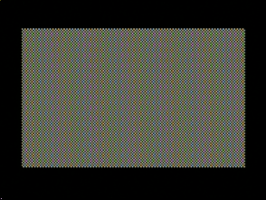
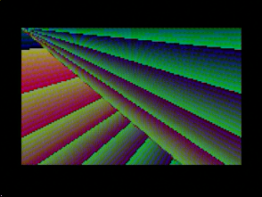

# MiSTer Tutorials

These are tutorials translated from the [mist](https://github.com/mist-devel/mist-board/tree/master/tutorials/soc) project to work with MiSTer.  

What is this?
-------------

This part of the tutorial was presented in [issue 26 '15 of the c't magazine](http://www.heise.de/ct/ausgabe/2015-26-Mit-FPGAs-Retro-Chips-implementieren-Teil-3-3010854.html).

Each lesson presented here explains a single aspect of the MiST
board. The lessons are not VHDL or Verilog tutorials. Instead the
lessons include all files required to build demo setups for the MiST
board. They come with compiled and synthesised binaries so you can
test run them before getting into the details.

Each lesson focuses on one aspect like the VGA output, then SDRAM, the
SD card etc etc. Most lessons use a VHDL Z80 CPU and implement a small
but fairly complete system on a chip (SoC) which can be used to
experiment with the lessons. But it can also be used as a basis for
bigger systems.

The intended audience of this are people who already have some basic
VHDL or Verilog knowledge and know how to use a tool like Quartus and
who want to learn how to use the various peripherals on the MiST
board.

Unless otherwise stated all code included comes without restrictions
and you can re-use it in any way be it for closed source or open
source projects. Most included third party code (T80, YM2149, PS2)
comes under GPL or simimlar license and may e.g. not be used closed
source projects or the like. Please have a closer look at the files
you intend to re-use for your project

[Lesson 1](lesson1): A VGA controller
--------------------------

A 160x100 pixel VGA controller based on the 640x400@70Hz VGA mode. A
simple b/w checkerboard is being displayed. The Video clock of 25.175
MHz is generated from the 27 MHz system clock using a PLL.

The VGA controller mainly consists of the two counters, one to count
the pixels per line (h_cnt) and one counting lines (v_cnt). Both
counters are used to generate the horizontal and vertical sync signals
and to determine the time where pixels are to be displayed. The
horizontal counter is directly updated by the pixel clock. The
vertical counter is updated once per line only.

The VGA controller has six output bits per color. On the MiST board
these are fed into a resistor ladder (r2r) which is used as a digital
analog converter to generate the analog video signals. Six bits are
sufficient for 2^6=64 shades per color resulting in a total of 262144
colors in total. Using PWM techniques more colors are
possible. E.g. the Amiga AGA core does that. This demo however just
displays a black'n white checkerboard.

Links:
 - https://eewiki.net/pages/viewpage.action?pageId=15925278

[Lesson 2](lesson2): Video memory and embedded ROM
---------------------------------------

The VGA controller is now being equipped with 16000 bytes of embedded
FPGA RAM as video memory (VMEM/VRAM). The resulting video controller
can display 256 colors in RGB 332 format (3 bits red, 3 bits green, 2
bits blue). A demo image is placed into an embedded ROM and copied
into screen memory at start up.

The graphics needs to be in 160x100 pixels in RGB332 format. The
img2hex.sh shell script uses the Linux tool "avconv" (on older distros
it may be named "ffmpeg") to generate a matching raw image from a
160x100 pixel PNG image. The resulting raw image is exactly 16000
bytes in size. img2hex.sh then calls the srec_cat to convert this into
intel hex format.

The ROM has been generated using Quartus' Megafunction wizard. It allows
to specify a intel hex file as the data source for the ROM.

[Lesson 3](lesson3): Z80 CPU and RAM
-------------------------

The T80 Z80 CPU core is being added. 4 kilobytes of RAM are added for
the CPU as well as 4 kilobytes of ROM. ROM and VRAM share the same
memory region as ROM is read only and (our) VRAM is write only. On
most systems video memory can be read and written which is quite
useful when altering video contents. In our SoC we implement the video
memory write only which is not the usual way to do it. But a platform
like an FPGA allows us to do this and if it turns out to be a bad idea
we can easily change this. But being able to map VRAM and ROM to the
same address space makes efficient use of the 64k address space the
Z80 CPU offers.

The CPU is clocked at 4 Mhz which is additionally to the VGA clock
generated by the existing PLL.

The ROM contents are compiled from a C source using the SDCC compiler
(http://sdcc.sourceforge.net). SDCC generates a intel hex file which
is directly included into the ROM by Quartus' Megafunction wizard like
the image data in lesson 2.

All memory is decoded only partially which means that the 4k ROM at
address 0x0000 is mirrored 7 times in the lower 32k memory area
(A15=0). The ROM shows up at addresses 0x0000-0x0fff, 0x1000-0x1fff,
0x2000-0x2fff, 0x3000-0x3fff, 0x4000-0x4fff, 0x5000-0x5fff,
0x6000-0x6fff and 0x7000-0x7fff. The 16000 bytes video of video memory
is mapped twice and can be written at address 0x0000-0x3ef7 and
0x4000-0x7e7f. Finally the 4K RAM is mapped to the upper half of the
address space (A15=1) and can be read and written at 0x8000-0x8fff,
0x9000-0x9fff, 0xa000-0xafff, 0xb000-0xbfff, 0xc000-0xcfff,
0xd000-0xdfff, 0xe000-0xefff and 0xf000-0xffff. The SDCC compiler by
default uses 0xffff for the stack going downwards and it used the
memory region from 0x8000 for global variables. The aforementioned
mirroring allows to use the default SDCC memory layout with only 4k
RAM. We can do this as long as we don't need the address space for
other purposes.

The test program is a simple graphics demo. It doesn't use any global
variables but uses the stack for local variables. Thus the running
demo shows that ROM as well as RAM are working as well as the video
memory, of course.

Links:
 - https://de.wikipedia.org/wiki/Zilog_Z80
 - http://sdcc.sourceforge.net/
 
[Lesson 4](lesson4): SDRAM
---------------

So far we've been using FPGA internal embedded RAM. This is very easy
to implement and use and incredibly fast. Unfortunately there's only a
little more than 70 Kilobytes of embedded memory available inside the
MiST's FPGA. Therefore the MiST comes with additional 32MBytes
SDR-SDRAM.

SDR-SDRAM is a more modern memory type than the DRAM that was used in
the homecomputer age. But it's also significantly older than the
latest DDR4/5-SDRAM memories todays computers use. The latest memory
types can be very fast under certain conditions but are very complex
to control. The usage of SDR-SDRAM was a useful tradeoff between speed
and ease of use. Furthermore modern RAMs don't match the retro
requirements very good.

The MiST comes with a 133MHz 16 bit wide SDR-SDRAM. This means that
the RAM can be clocked at up to 133 Mhz and that it transfers 16 bits
(two bytes) at once. A SDR-SDRAM uses a synchronous protocol to access
its contents unlike DRAM which was asynchronous. In the first access
stage (RAS cycle) a part of the desired address information is sent
into the SDRAM. After a certain pause the second half of the address
information (CAS cycle) is sent to the SDRAM and finally after another
pause the data itself can be read or written. The lengths of these
pauses depend on certain SDRAM parameters and on the clock that's
actually being used to access the SDRAM.

On the MiST a typical single SDRAM transfer requires 8 clock
cycles. Thus the SDRAM is typically clocked at 8 times the CPU clock
so the SDRAM can perform a full access cycle during one CPU
cycle. Since the CPU is clocked at 4 Mhz in our SoC the SDRAM is
clocked at 32Mhz. The 32Mhz are again generated by our PLL and the
4Mhz are now derived from the 32Mhz by dividing it by 8.

There is a counter "q" inside the SDRAM controller [`sdram.v`](lesson4/sdram.v) which
permanently counts from 0 to 7. This counter synchronizes itself to the
CPU clock to make sure the counter always starts with 0 at the begin
of a CPU cycle. When running at 32Mhz and with one full memory
transfer every 8 cycles the resulting total access time is 250ns. This
was a typical RAM access rate in the age of home computers. The SDRAM
supports a clock of 133Mhz and thus access times of ~60ns are
possible. Special burst access modes of the SDRAM can be used to read
more than 16 bits in one access cycle. But these must be consecutive
memory contents and require a CPU to have caches to increase the
system performance. Retro CPUs usually don't have that. The limit for
single random accesses is ~60ns (this is actually still the same with
modern DDR RAM).

The SDRAM has a 16 bit data bus but our SoC is a 8 bit system. We thus
simply ignore one half of the data bus. As a result only 16 of the 32
MBytes can be addressed. This is still much more than the Z80 can
easily handle. The Z80 has a 16 bit address space giving a total of 64
kBytes directly accessible memory. The SoC is currently using the
upper half of this for RAM. Thus only 32 kBytes of the SDRAM is
actually being used. It would be possible to implement banking or the
like to give the Z80 access to more memory. But this requires special
support in the software which we'd like to avoid.

SDRAMs need to be initialized before they are fully operational. The
[`sdram.v`](lesson4/sdram.v) contains a simple logic to do this once the PLL reports that
it's generating stable clocks via its locked signal. The CPU is being
kept in reset a little longer to make sure the SDRAM is ready once the
CPU starts running.

The SDRAM timing is quite critical. One result of this is that a
second 32Mhz clock is generated by the PLL with a small offset (phase
shift) of -2.5ns. This clock is fed into the SDRAM. This makes sure
that the FPGA and the SDRAM aren't changing signals at exactly the
same time. Instead one of them changes signals on one clock and the
other component sees stable signals when it's own slightly shifted
clock changes.

Further stability is added by the soc.sdc constraints file. This tells
Quartus about timing critical signals. Quartus will then make sure
these signals need to be connected in a way that they have a minimum
delay.
